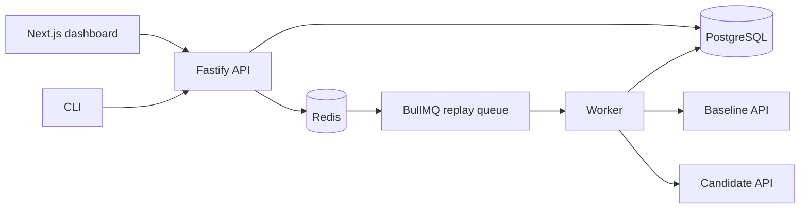

# ShadowCheck

ShadowCheck replays recorded HTTP traffic against a baseline API and a candidate API, then reports response contract, status, header, and latency regressions. It is designed as a small internal developer platform for release checks, not a production traffic proxy.

## What it does

- Imports the native ShadowCheck JSON format or HAR files.
- Redacts secrets and configured JSON fields before traffic is written to PostgreSQL.
- Replays traffic through a BullMQ worker with bounded concurrency, rate limits, timeouts, cancellation, and response size limits.
- Compares status codes, JSON structures and values, selected headers, OpenAPI response contracts, and latency.
- Presents runs and side by side response details in a Next.js dashboard.
- Provides a CLI with CI friendly exit codes.

## Architecture



## Quick start

Copy `.env.example` to `.env` and replace `ENCRYPTION_KEY` with a base64 encoded 32 byte key. For local fixture traffic, keep `ALLOW_PRIVATE_NETWORK_TARGETS=true`.

```bash
pnpm install
pnpm db:generate
pnpm docker:up
pnpm db:seed
```

Open [http://localhost:3000](http://localhost:3000). The seeded **Demo Commerce API** has eight requests and deliberately produces four passes, one latency warning, and three breaking regressions. To start the entire demo stack and seed it in one command:

```bash
pnpm demo
```

Use `pnpm docker:down` to stop services. Add `-v` to the Docker command yourself only when you intentionally want to remove the local database volume.

## Traffic formats

ShadowCheck JSON is an array:

```json
[
  {
    "name": "Get user",
    "method": "GET",
    "path": "/users/1",
    "headers": { "Accept": "application/json" }
  },
  {
    "name": "Create order",
    "method": "POST",
    "path": "/orders",
    "body": { "email": "anna@example.com", "quantity": 2 }
  }
]
```

HAR import extracts the method, path, query parameters, headers, and body. Imported data passes through the same redaction pipeline first.

## Replay behavior

Runs are asynchronous. The API creates a run and a job for each request, then the worker executes the baseline and candidate requests. Workers enforce `REPLAY_CONCURRENCY`, per project `maxConcurrency`, and optional `requestsPerSecond` pacing.

GET and HEAD are permitted by default. A project must explicitly enable POST, PUT, PATCH, and DELETE replay. Safe methods receive one retry for transient connection failures and 502/503/504 responses; write methods receive one attempt so ShadowCheck does not silently duplicate side effects. All target requests have timeouts and response bodies are limited by `MAX_RESPONSE_BODY_BYTES`.

Arrays are order sensitive. Ignore rules such as `$.requestId` and `$.metadata.timestamp` omit dynamic paths. Field removal and type changes are breaking; added fields are informational; changed values and header differences are warnings. Latency thresholds are project settings and only apply when baseline latency meets the configured minimum.

## Security

Sensitive headers (`Authorization`, `Cookie`, `X-API-Key`, and related names) and custom header/JSON path rules are redacted before persistence. Environment credential values are AES-256-GCM encrypted with `ENCRYPTION_KEY`, never returned by the API, and excluded from logs. The replay worker accepts only HTTP(S), rejects credential bearing and scheme relative URLs, prevents request paths from changing host, resolves target names, and blocks private/link local addresses unless the local deployment flag allows them.

This is a local/internal V1. It intentionally has no accounts or authorization layer. See [security.md](docs/security.md) before exposing it beyond a trusted network.

## CLI and CI

```bash
pnpm --filter @shadowcheck/cli dev import --project demo-commerce-api --file fixtures/sample-traffic.json
pnpm --filter @shadowcheck/cli dev run --project demo-commerce-api --wait
pnpm --filter @shadowcheck/cli dev status --run <run-id>
pnpm --filter @shadowcheck/cli dev report <run-id> --format json
```

The CLI returns `0` when a completed run has no regressions or execution errors, otherwise `1`. [The example workflow](.github/workflows/shadowcheck-example.yml) shows a self-contained fixture replay.

## Development commands

| Command | Purpose |
| --- | --- |
| `pnpm dev` | Start API, worker, dashboard, and fixture API processes. |
| `pnpm build` | Build packages and dashboard. |
| `pnpm typecheck` | Typecheck all workspaces. |
| `pnpm lint` | Run ESLint. |
| `pnpm test` | Run unit tests. |
| `pnpm test:integration` | Run real HTTP fixture integration tests. |
| `pnpm db:migrate` | Create and apply a local Prisma migration. |
| `pnpm cleanup` | Remove completed runs older than the retention period. |

## Screenshots

Run the demo and capture real screenshots of the project overview, replay result table, response detail, and configuration screen. Store them under `docs/screenshots/` before adding them to this README; no mock screenshots are included.

## Limits and future work

The V1 supports a few thousand developer machine replay requests, not production scale traffic. It does not preserve HTTP timing or session state, use a distributed rate limiter, support order-insensitive array matching, resolve external OpenAPI references, or guarantee exactly once replay of a write if a worker crashes between its external request and database write. These limits are deliberate and described in the linked documents.
