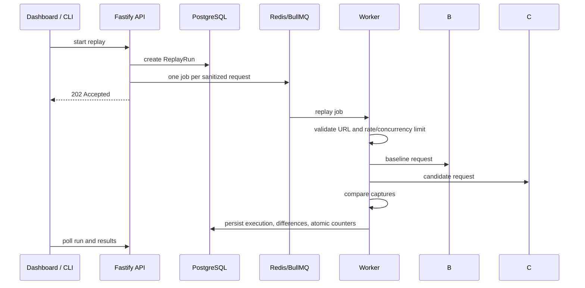

# Architecture

ShadowCheck has three deployable applications: the Next.js dashboard, Fastify API, and BullMQ worker. The dashboard only reads and writes API state. Fastify validates inputs, persists configuration, and queues work. Workers own all outbound replay traffic.

Long running replay is asynchronous because an HTTP route should return promptly and because traffic can take much longer than a browser request. BullMQ provides durable job handoff and recovery of jobs that were never completed. PostgreSQL stores the user facing record of runs, requests, and differences; Redis only coordinates queue work and cancellation signals.

The comparison package has no Fastify, Prisma, or UI dependency. It recursively compares JSON in request order, derives structure through the same traversal, and yields compact structured differences. Ignore paths are evaluated before a child difference is recorded. The worker applies project policy to statuses and latency and additionally validates the candidate response against a supported subset of OpenAPI 3 response schemas.

The redaction package operates on a structured clone before the database insert. Built in sensitive header names and project custom rules are masked. Environment credentials are different: they are encrypted at rest, joined only in worker memory, and are never serialized in a dashboard API response.

Run counters are incremented in the same database transaction that creates the execution. The execution uniqueness constraint makes duplicate job delivery idempotent. The final status uses a conditional SQL update after the counter update, so simultaneous final jobs can only mark a running run complete once.
